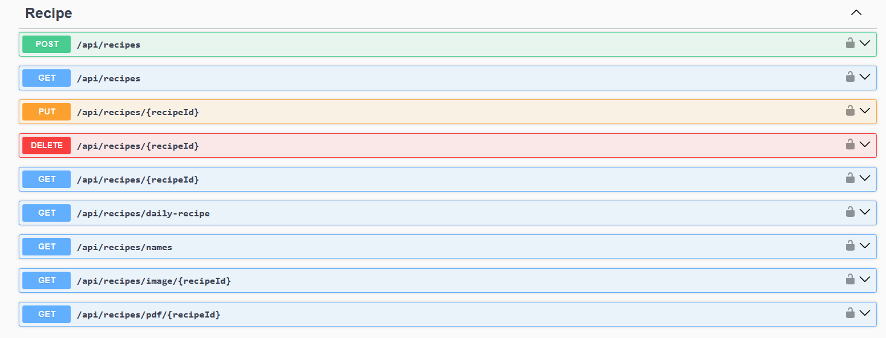
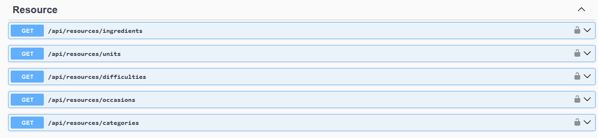
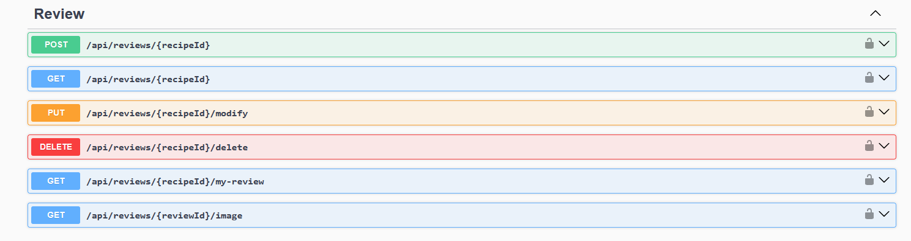
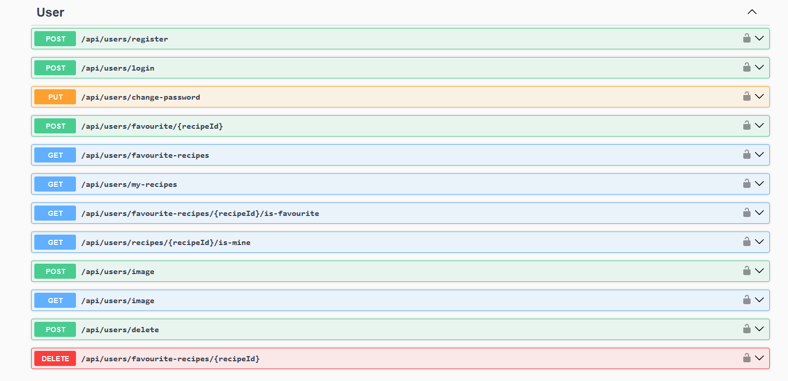

# Cooking Assistant API

## Introduction
Cooking Assistant API is a backend service developed using ASP.NET Web API in C#. It is designed to support the , enabling users to manage recipes effectively. The API facilitates user registration and authentication through JSON Web Tokens (JWT).

Users can add, modify, delete, and manage recipes. Additionally, they can rate recipes, add them to their favorites, and generate PDF files for specific recipes. The API also supports profile and recipe images, which are stored in the database as byte arrays. Recipes can be paginated, sorted, and filtered based on various criteria, providing a seamless browsing experience.

---
## Authors
- [filip-wojc](https://github.com/filip-wojc)
- [DarknessoPirate](https://github.com/DarknessoPirate)

---
## Features
- **User Authentication**: Secure registration and login using JWT tokens.
- **User Management**: Users can change password, profile picture or delete their account.
- **Recipe Management**: Add, edit, and delete recipes.
- **Favorites and Ratings**: Users can rate recipes and add them to their favorites.
- **Image Uploads**: Users can upload profile pictures and recipe images stored as byte arrays.
- **PDF Generation**: Generate PDF files for recipes.
- **Sorting and Filtering**: Recipes can be sorted by ratings, preparation time, difficulty, review count, and caloricity. Filtering options include difficulty, category, and occasion.
- **Searching recipes**: Recipes can be searched by name or description
- **Pagination**: Customizable pagination allowing users to specify page number and size.
- **Validation**: Data validation using FluentValidation.
- **Swagger Documentation**: Built-in Swagger for testing and documentation.
- **Caching**: Enabled caching for performance optimization.
---

## Technologies Used
- **C#** - Programming language
- **ASP.NET Web API** - Backend framework
- **SQLite** - Lightweight database
- **Entity Framework** - ORM for database interactions
- **FluentValidation** - Input validation
- **AutoMapper** - Object mapping
- **Swagger** - API documentation and testing
- **PdfSharpCore** - PDF file generation
- **JWT Tokens** - Secure authentication
- **Dependency Injection** - Built-in dependency injection for service management
- **xUnit** - For writing integration tests
---

## API Endpoints
- **Recipe Controller**:

- **Resource Controller**:

- **Review Controller**:

- **User Controller**:

---

## How to use
1. Clone this repository
2. Open this project in visual studio
3. If you want to use this API with [CookingAssistant Mobile App](https://github.com/filip-wojc/CookingAssistant), edit launchSettings.json file by adding your local Ipv4 address in applicationUrl in http section
4. Run project using http
---

## Future Development Plans
1. **Performance Optimization**: Further enhance database query performance and caching.
2. **Multi-language Support**: Provide localization options for multiple languages.
3. **Google Authentication**: Authentication using Google
---

## License
This project is available for use under the MIT License.

---
If you have any questions, feel free to ask.
